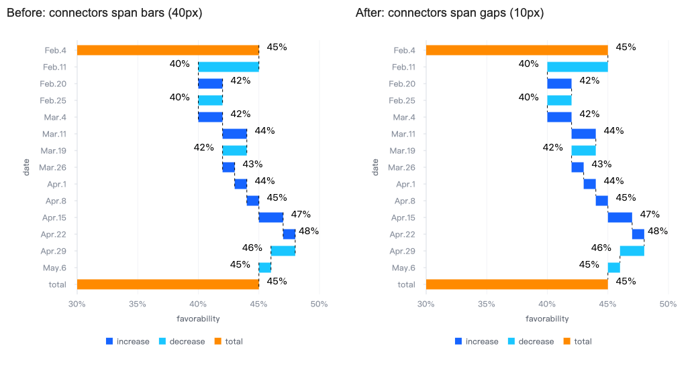

# 瀑布图连接线方向修复计划

**目标：** 修复横向瀑布图连接线延伸到柱外侧的回归，保留显式反向轴的正确行为。

**方案：** 在 WaterfallSeries 现有方向判断中归一化 Y 轴 inverse；使用真实 VChart 渲染验证连接线端点与柱边界，不再用 mock 的布尔返回值固化错误行为。

**技术栈：** TypeScript、现有 Jest/Electron 测试环境。

**约束：** 不改变公共 API、依赖、图像基准或柱样式；不新增每图元分配。单任务在当前会话内执行。

## 实施步骤

- [x] 替换 `packages/vchart/__tests__/unit/series/waterfall.test.ts` 中直接断言私有方向方法的测试：渲染正负变化与总计柱，读取 bar 图元和 leaderLine 图元，检查连接线在累计顺序中的上一柱与下一柱相邻边缘之间。覆盖两种方向、三种 inverse 配置、两种 calculationMode，以及 inverse 更新。
- [x] 在未修复源码上运行测试，确认横向配置在端点几何断言处失败。
- [x] 修改 `packages/vchart/src/series/waterfall/waterfall.ts`：横向方向判断返回 `!this._yAxisHelper?.isInverse?.()`，纵向保持现有逻辑，并解释 Y 轴屏幕方向。
- [x] 运行瀑布图、柱图和瀑布图数据转换测试；运行 TypeScript、定向 ESLint、Prettier、`git diff --check`。
- [x] 使用原始 case 在浏览器核对修复后的连接线，并记录验证结果。
- [ ] 添加中文 patch 变更说明，提交并推送 `codex/fix-horizontal-waterfall-leader-line`，创建目标为 develop 的 PR。

## 验证命令

在 `packages/vchart` 执行：

```sh
./node_modules/.bin/jest --runInBand --runTestsByPath __tests__/unit/series/waterfall.test.ts
./node_modules/.bin/jest --runInBand --runTestsByPath __tests__/unit/series/waterfall.test.ts __tests__/unit/chart/bar.test.ts __tests__/unit/data/waterfall-transform-options.test.ts
./node_modules/.bin/tsc --noEmit --project tsconfig.json
./node_modules/.bin/eslint src/series/waterfall/waterfall.ts __tests__/unit/series/waterfall.test.ts --quiet
./node_modules/.bin/prettier --check src/series/waterfall/waterfall.ts __tests__/unit/series/waterfall.test.ts
```

## 完成标准

新增回归先失败、修复后通过；所有方向组合连接相邻柱边界，显式 inverse 更新有效；PR 说明包含原因、修复前后行为、Bugserver case 和实际验证结果。

## 验证结果

- 修复前，6 组横向配置和 1 项横向轴更新用例均在连接线端点几何断言处失败；6 组纵向配置未出现该问题。
- 修复后，瀑布图 13 项、柱图 8 项、瀑布图数据转换 2 项，共 3 个套件、23 项测试通过。
- `tsc --noEmit`、定向 ESLint 和 Prettier 均通过。
- 本地源码通过 esbuild 生成浏览器验证构建，用原始 Bugserver spec 复现：14 条可见连接线均从 40px 恢复为 10px，所有柱的几何属性前后一致。
- 仅将旧方向判断代入同一本地构建作为修复前对照；右侧使用本次实际源码。对照图见下。
- 原私有方法重命名为 `_isCategoryAxisReversed`，明确表达归一化后的屏幕分类方向，避免与 axis helper 原始 inverse 混淆。


