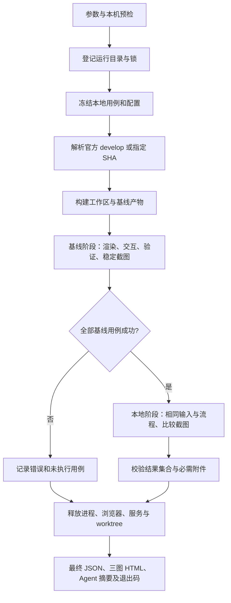

# VChart 本地视觉测试工具设计 v1

状态：规范化实现已接入，平台验收记录以 README 为准；Linux 待验收。日期：2026-09-22。

当前补充目录化用例和 `--dir` 递归选择；执行范围仅为全量、目录或单 case。清单与冻结机制保持一致，报告明确显示选中数量与总量，目录规范见 [用例说明](./cases/README.md)。

本文将已验证的原型整理为可维护的仓库工具。本文记录设计决策与验收目标；当前实现和实际完成的验证以 README 及对应运行报告为准。

## 1. 产品边界与完成定义

第一版服务 VChart 核心包的本地开发：以同一套仓库内用例，在同一台机器分别运行当前工作区产物与官方 develop 固定提交的产物，输出可以供开发者及编码 Agent 检查的证据。

使用现有 10 个本地精简用例跑通正式工具的全流程。用例与线上 BugServer 没有运行时依赖，不读取、不导出、不同步线上 case。默认比较仍需要访问公开 GitHub，以及冷启动时的公开包和浏览器下载源；“不依赖内网”不等于“所有命令完全离线”。依赖准备完成后的自比较不获取远端基线；HTML 报告可离线打开。

本阶段包含：用例发现与校验、环境预检、基线解析、双侧构建与隔离、浏览器渲染和交互验证、截图比较、三图 HTML、结构化 JSON、Agent 摘要、异常退出与资源清理。

沿用 macOS/Linux、Node.js 22、锁定版本的 Playwright/Chromium。暂不增加多产品抽象、独立 npm 工具包、扩展包、浏览器矩阵、Web 管理后台、GitHub CI、永久图片基线或接受差异机制。后续出现第二个产品的真实接入需求，再评估提取共享代码。

第一版完成的含义是：新贡献者按文档准备环境后，能够添加一个本地 case、执行双侧对比、定位差异、按指定 SHA 重跑；所有异常均有明确退出码和诊断；macOS 与 Linux 分别完成验收。

## 2. 已验证部分与需要规范化的部分

| 范围     | 原型已具备                                              | 第一版需要补齐                                                     |
| -------- | ------------------------------------------------------- | ------------------------------------------------------------------ |
| 执行入口 | 默认 develop、指定 SHA、单 case、自比较、0/1/2 退出码   | 明确预检与列举入口，错误输出统一，导入模块不注册进程级副作用       |
| 用例     | 10 个本地 spec，4 类交互断言                            | 一用例一文件、显式注册、契约校验、精确来源、每个用例的语义检查     |
| 构建     | 最小依赖链、detached worktree、当前未提交修改、基线缓存 | 校验新产物、依赖准备诊断、构建配方独立摘要、缓存损坏恢复           |
| 输入冻结 | 复制用例目录，两侧共用                                  | 从冻结目录读取清单，递归记录相对路径与摘要，发现集合与执行集合一致 |
| 结果     | 三图、JSON、Markdown，缺图转执行错误                    | 固定结果协议、精确 ID 集合校验、稳定错误码、原始结果增量落盘       |
| 清理     | 普通结束和信号路径已验证                                | 清理步骤互不阻断、锁所有权、报告失败兜底、阶段失败耗时             |
| 验收     | macOS 自比较与故障注入通过                              | 重构后重新验收；外部贡献者准备环境检查；Linux 实测                 |

设计前原型的问题包括：入口文件同时承担 Git、构建、缓存、服务、进程和编排；缓存配方摘要直接使用整个入口文件；用例来源行号通过 `id` 字符串查找；顶层文件摘要未覆盖未来嵌套资源；准备失败发生在运行目录建立之前时没有文件报告；阶段完整性目前主要检查数量而非准确的用例 ID 集合。规范化应解决这些边界，而不是简单移动文件。

## 3. 命令与配置

保留现有命令，不要求贡献者迁移已有用法：

```sh
node packages/vchart/scripts/visual-test.mjs
node packages/vchart/scripts/visual-test.mjs --baseline <40位SHA>
node packages/vchart/scripts/visual-test.mjs --dir components/label
node packages/vchart/scripts/visual-test.mjs --case pie-label
node packages/vchart/scripts/visual-test.mjs --self-compare
```

包内 `test:visual` 继续指向相同入口。`--dir` 和 `--case` 互斥，均可与默认基线、指定 SHA 或自比较组合使用。未知选项、空字符串、未知 case 和互斥参数均失败，不静默忽略。

设计新增两个只读入口：

- `--list`：列出本地用例的 ID、目的、文件和来源示例，不构建、不拉取基线、不启动浏览器。
- `--check`：检查 Node、Git、受支持平台、用例契约、Playwright/Chromium 安装与当前工作区依赖。用最小浏览器启动/关闭检查系统库；不截图、不构建、不自动安装依赖。

`--list`、`--check` 为独立模式，仅可与 `--help` 的优先帮助行为共存；其他运行参数组合报错。`--help` 不要求先安装 Playwright。`--check` 只验证本机准备状态，不声称基线可下载或未来构建必定成功。

环境、截图阈值和超时集中在仓库内配置文件，纳入代码审查，不开放任意 Playwright 参数透传。第一版不增加并发数、自动重试、阈值覆盖或更新基线的 CLI 开关。安装沿用现有 Rush 和 Chromium 准备命令；缺依赖时给出命令，工具不修改依赖版本。

## 4. 代码组织与职责

建议在现有入口旁按真实职责拆分，不创建通用框架：

```text
packages/vchart/
  scripts/
    visual-test.mjs             # CLI、参数解析、运行入口
    visual/
      runner.mjs                # 冻结输入、阶段编排、最终状态
      build.mjs                 # 官方基线、worktree、构建与缓存
      runtime.mjs               # 子进程、回环 HTTP 服务、资源清理
    visual-test.test.mjs        # 工具契约和故障路径检查
  __tests__/visual/
    cases/
      index.mjs                 # 显式清单：ID、文件、来源与加载函数
      bar-stack.mjs             # 其余 9 个 case 同级
      ...
    helpers.mjs                 # 已有重复定位与状态等待逻辑
    page.html                   # 注入指定产物、创建/释放实例
    visual.spec.mjs             # 通用生命周期与截图断言
    playwright.config.mjs       # 唯一环境与比较策略
    reporter.mjs               # Playwright 事件与附件转换
    report.mjs                 # 汇总与 HTML/Markdown 输出
    README.md                  # 使用与新增 case 教程
    DESIGN.md                  # 本设计
```

`.mjs` 沿用 Node 直接运行，核心对象以 JSDoc 描述，避免为测试工具增加独立编译链。CLI 不被浏览器导入；用例文件不导入 Node API 或测试框架运行时代码，允许两侧页面共用。用例执行函数中通过 `page` 操作页面，不直接引用仓库 VChart 源码。

仅在函数需要独立验证或有真实调用方时导出。`runtime.mjs` 采用本次运行的资源集合；信号处理器在入口注册、结束后移除，不在模块导入时安装。保留中文核心函数说明。

## 5. 用例契约与首批覆盖

清单负责元数据和模块路径；每个文件默认导出 `createSpec()`、可选 `exercise(page)` 和必需的 `verify(page)`。

| 字段             | 规则                                                     |
| ---------------- | -------------------------------------------------------- |
| `id`             | 清单内唯一，`^[a-z][a-z0-9-]*$`，已有 10 个 ID 保持不变  |
| `purpose`        | 一句话说明要观察的行为，而不是只写图表类型               |
| `file`           | `cases/` 内明确的相对模块路径；不接受越界路径            |
| `sourceExample`  | 可选的真实公开示例仓库相对路径；无来源时省略             |
| `createSpec()`   | 返回新的确定性 spec；固定数据，不导入当前源码、不读网络  |
| `exercise(page)` | 可选，执行真实鼠标动作或公开 API；操作成功不代表用例通过 |
| `verify(page)`   | 验证目标状态；条件不满足抛出错误，不以截图生成替代断言   |

不把元数据在清单与用例文件中重复维护。清单校验覆盖重复 ID、文件缺失、路径越界、非法导出及空选择；无效清单在构建前失败。实现时采用明确模块映射，并确保 Node 端验证与浏览器加载使用同一冻结清单。

每个用例只输出最终一张图。公共检查确保实例、Canvas、数据图元及有效像素存在；用例检查确保其目标行为发生。不能依赖图元内部结构完成的稳定语义检查，不强行编写内部节点精确断言；可以检查公开 spec/API 可观测状态，并用截图覆盖布局。确实需要 VRender 场景树定位鼠标目标的交互，统一放在 `helpers.mjs`，定位失败必须显式报错。

下表来源均为 `packages/vchart/__tests__/runtime/browser/test-page/` 内现存文件：

| ID               | 来源文件                    | 最终状态与验证要求                                                      |
| ---------------- | --------------------------- | ----------------------------------------------------------------------- |
| `bar-stack`      | `bar.ts`                    | 固定正负两组数据；有效堆叠柱图，截图覆盖零基线与正负累计位置            |
| `line-gap`       | `data-zoom-brush-line.ts`   | 固定空值并显式指定连接策略；断点/连接规则写入 purpose，由截图覆盖形状   |
| `scatter-symbol` | `scatter.ts`                | 明确数据项与符号/大小映射，非空点集；截图覆盖位置、形状和大小           |
| `pie-label`      | `pie-label.ts`              | 固定大小扇区、外标签与引导线；数据/标签配置有效，截图覆盖防重叠和引导线 |
| `axis-label`     | `axis-label-layout.ts`      | 固定长英文分类和旋转配置；截图覆盖裁切、旋转及轴布局                    |
| `waterfall`      | `waterfall.ts`              | 固定增减项与总计；验证数据和总计配置，截图覆盖累计高度和连接线          |
| `legend-filter`  | `multiple-legend-layout.ts` | 点击一个图例项；选择状态和可见数据均改变，最终截图反映筛选              |
| `tooltip-hover`  | `tooltip.ts`                | 悬停已知数据点；目标 HTML tooltip 可见且包含精确期望值                  |
| `datazoom-drag`  | `datazoom.ts`               | 拖动控件；公开缩放事件范围改变，可视数据减少，鼠标移出后截图            |
| `update-resize`  | `event-update-spec.ts`      | 调用 update/resize；更新值和画布尺寸均正确，等待最终绘制                |

静态用例的语义检查不是另写一套像素布局算法；它防止空图、错误输入与错误图表类型，视觉比较负责呈现差异。新功能尚未被基线支持时是执行错误，不能自动跳过、换旧用例或算作通过。

初期不增加用例总数。先迁移并审核这 10 个精简 case，不改原始调试示例。新增用例需说明现有覆盖的缺口、确定性条件和故障注入办法，避免重新形成大量重复样例。

## 6. 一次运行的明确流程



自比较跳过远端解析和基线构建，以同一次本地构建的副本作为两侧输入，其余生命周期完全一致。目录和单 case 模式只缩小冻结清单中的选择集。

1. 先完成廉价参数检查；建立可写运行目录后立即记录运行标识、请求参数和未完成状态。缺少依赖、基线拉取/构建失败等均尽可能生成文件诊断。参数无法解析或输出目录不可写时允许仅 stderr，返回 2，明确没有生成报告。
2. 获取带 `runId`、PID、启动时间及运行目录的仓库运行锁。保留同一工作区串行限制，因为本地构建会写公共产物目录。不静默夺取未知锁或终止已有进程；陈旧锁给出检查/清理路径。
3. 复制用例、页面、配置与执行代码到运行目录。从副本发现并校验选择集。按排序后的相对路径、内容摘要生成递归清单，纳入所有实际测试资源；先前对源码目录的发现结果不能代替副本。
4. 从固定的官方 GitHub URL 获取 develop 或完整 SHA，固定提交身份；不依赖 fork 的 origin，也不静默使用旧缓存。记录请求 ref 和解析 SHA。
5. 本地沿用已安装依赖；基线 detached worktree 按自身锁文件安装。允许复用包管理器下载缓存，但两侧的安装目录与 workspace 包链接必须各自独立。记录锁文件、Node、Rush/包管理器版本和受控构建配置。
6. 两侧使用同一最小构建配方。明确生成文件和输出目录，构建前只清理属于本次构建的生成产物；禁止递归清理源码或用户未跟踪文件。构建命令成功后仍检查目标产物确实新生成、非空，再复制并校验摘要。工作区在本地构建前后发生变化则终止，保留用户改动。
7. 启动只监听 `127.0.0.1` 的随机端口服务，仅服务冻结用例和产物。浏览器执行公共绘制检查、交互、语义断言、字体就绪和稳定截图。稳定截图后再次检查页面错误，随后比较。
8. 基线阶段生成本次临时快照；所有基线用例成功后才启动本地阶段。本地 `updateSnapshots: 'none'`，比较前确认基线存在。失败期间已经运行的 case 保留结果，其余 case 为 `not_run` 并给出原因。
9. 将发现的选择集与两阶段结果按 ID 精确核对；重复、额外、缺失结果均为执行错误，不能仅比较数量。每个成功或差异 case 必须有两侧最终 PNG；差异结果还必须有对应差异图。
10. 清理各类资源，最后汇总；清理异常单独记录，不覆盖原始失败。输出目录保留原始日志和阶段结果，报告生成异常仍返回 2，并在 stderr 给出可用证据位置。

环境固定：单 worker、无重试、全新 context、1000×800、图表 800×600、DPR 1、白底、en-US、UTC、Arial、30 秒单用例超时。禁用图表动画、tooltip 过渡与页面动画；固定页面截图包含 HTML tooltip。页面禁止远端请求，资源加载失败、页面异常及未处理 rejection 均失败。字体不跨机器复用截图，macOS/Linux 分别验收。

沿用 Playwright 的 PNG 比较与附件，颜色阈值 0.1、允许差异像素数 0；不实现第二套比较算法。比较抛错不能一律标为视觉差异：只有有效输入完成比较且产生视觉差异证据时才标为 `diff`，读取、解码、超时、附件缺失仍为执行错误。Playwright 提供原生截图比较与报告扩展能力：[视觉比较](https://playwright.dev/docs/test-snapshots)、[Reporters](https://playwright.dev/docs/test-reporters)。

## 7. 缓存、复现与运行隔离

只缓存最近一次成功的官方基线产物，每次重新截图。本地每次构建。缓存键包含 SHA、基线锁文件摘要、完整 Node 版本、平台/架构、实际构建配方及相关工具版本；拆分后计算 `build.mjs` 等实际构建依赖的摘要，避免改报告样式导致重新安装基线。

缓存 metadata 和 bundle 校验不一致、缺失或解析失败时记为 miss 并重建，而不是当作回归失败；权限或磁盘错误须明确报错。先写临时目录，成功后在锁保护下替换最近缓存，不发布半成品。基线 build 成功与截图成功分别记录，缓存只承诺产物构建成功。

复现命令固定基线 SHA，并标出本地 HEAD、dirty 和修改摘要。摘要不包含未提交修改的内容，不能凭摘要恢复工作区；报告保留冻结用例和两侧产物，便于检查实际输入，第一版不额外增加 replay 命令。`--self-compare` 只验证确定性，不能证明图表内容正确。

Ctrl+C/SIGTERM 终止本次子进程组，回收浏览器及 HTTP 服务，再清理本次 worktree 和锁。每项清理独立 try/finally，前一项失败不能阻止后一项；主错误和清理错误同时保留。SIGKILL/断电无法保证清理，遗留锁和阶段证据必须支持人工定位，工具不自动清除不属于本次运行的资源。

## 8. 结果协议与两类读者

继续使用 `summary.json` 作为唯一最终结果；保留 `schemaVersion: 1` 的已有字段与语义，兼容性扩展只增加可选字段。破坏性变更必须提升版本并说明迁移。用可运行契约测试验证生成结果，第一版不为此引入新的 schema 库。

建议补充 `runId`、`finalized`、请求参数、比较策略、冻结清单、阶段结果和诊断 `code`。运行中采用 `finalized: false` 和明确的未完成诊断；正常结束后原子写入最终 summary，HTML 与 Markdown 只渲染该对象。原始阶段结果按用例完成落盘，进程异常时不只依赖 `onEnd` 才有结果。

| 层级                   | 状态规则                                               |
| ---------------------- | ------------------------------------------------------ |
| 用例 `passed`          | 两侧执行、语义断言与截图成功，且图片无差异             |
| 用例 `diff`            | 执行成功、图片比较完成，存在视觉差异并保留证据         |
| 用例 `error`           | 执行、断言、截图、比较或必要证据失败                   |
| 用例 `not_run`         | 尚未完成两侧比较；记录阻断阶段和原因，不混为失败断言   |
| 运行 `error` / exit 2  | 任意执行/清理/报告错误，或空集、缺失结果、未完成选择集 |
| 运行 `diff` / exit 1   | 全部选择集有效完成，至少一个差异，没有执行错误         |
| 运行 `passed` / exit 0 | 全部选择集有效完成且无差异                             |

`complete` 仍表示所有所选用例是否完成有效比较，与 `finalized` 区分：一个正常结束的失败运行可以 finalized=true、complete=false；一个比较完整但清理失败的运行可以 complete=true、status=error。

诊断沿用 `phase`、`stage`、`category`、`message`；增加稳定 `code`，例如 `BASELINE_FETCH_FAILED`、`BUILD_FAILED`、`RESOURCE_FAILED`、`INTERACTION_ASSERTION_FAILED`、`TIMEOUT`、`MISSING_ARTIFACT`、`RESULT_SET_MISMATCH`、`RUN_INTERRUPTED`、`CLEANUP_FAILED`。错误来自明确失败位置，Agent 不需要解析自然语言来推断类别。保留原始错误与日志路径，不自动断言根因。

HTML 保留三图、四类计数、问题优先、用例/状态筛选、原图查看、源码位置、冻结副本和复现命令。成功 case 不伪造差异图；缺图显示明确诊断。所有图片链接为相对路径，可整体搬迁，不需要常驻服务或外网资源。

Agent 先读 `agent-summary.md` 的失败/未完成摘要，再读 JSON、源码或图片。JSON 使用相对证据路径，不包含图片 Base64；原始附件、trace 与日志按需读取。报告中没有模型调用、自动修复、自动放宽阈值或自动接受差异逻辑。

## 9. 交付步骤与验收门槛

| 阶段          | 实施内容                                                                       | 完成证据                                                                                  |
| ------------- | ------------------------------------------------------------------------------ | ----------------------------------------------------------------------------------------- |
| A：固定契约   | 拆分 10 个 case、显式清单、verify、来源记录、list/check、冻结输入              | 现有四个运行命令兼容；清单错误在构建前失败；迁移前后同产物无新增图片差异                  |
| B：执行可靠性 | 拆分编排/构建/资源生命周期，精确选择集校验、缓存完整性、准备失败诊断、锁与清理 | 默认官方 develop 和指定 SHA 真正双侧构建通过；fork origin 不影响基线；失败路径返回 2      |
| C：报告协议   | 固定 summary 契约、阶段增量记录、原子终态、三图/Agent 一致性                   | passed/diff/error/not_run 四类有实际或故障注入证据；缺附件不能变成 passed；离线页面可打开 |
| D：平台验收   | 外部准备环境验证、macOS/Linux 重复执行、耗时与清理检查、中文说明               | 两平台独立验收记录；全部必要检查完成才移除“原型”标识                                      |

每阶段保持可执行，不一次性推倒重写。保留已验证原型作为行为参照，故障自检复用现有测试入口；故障注入只操作独立验证目录，不修改用户业务源码。

正式验收清单：

- [ ] 两平台各 5 次完整十用例自比较：无差异、无执行错误。
- [ ] 默认官方 develop、固定 SHA、单 case 均完整执行；fork origin 不改变默认基线。
- [ ] 同一冻结 case 仅改变候选产物的颜色、位置、标签，均能检出差异并返回 1。
- [ ] 工作区未提交源码进入本地构建；构建前后原有文件/索引保持，期间输入变化明确失败。
- [ ] 基线失败、当前失败、浏览器启动失败、脚本缺失、渲染异常、超时、截图缺失、报告失败返回 2。
- [ ] 四类交互分别抑制动作后必定失败；静态用例的错误输入、空绘制被检查捕获。
- [ ] 空清单、重复 ID、错配结果、缺失结果、额外结果、缺失差异图不能产生通过结论。
- [ ] 冷构建、缓存命中、缓存损坏重建均验证；记录 fetch、安装/构建、两侧截图、清理、报告阶段耗时，失败阶段也记耗时。
- [ ] 截图阶段没有外网请求；干净公开环境可以完成依赖准备，不需要内网服务或凭证。
- [ ] 正常退出、构建时和截图时 Ctrl+C/SIGTERM 无本次遗留进程和服务；重复运行无端口冲突。
- [ ] 锁冲突不影响其他运行；清理失败保存原始错误；不可写输出路径给出明确终端诊断。
- [ ] HTML 三图和 Agent JSON/Markdown 状态一致，目录搬迁后图片可用；人工故障演示不混入真实回归报告。

现有 macOS 原型证据用于说明方案可行，不替代上述正式版验收；Linux 当前仍未验收。内网 BugServer 继续承担发版前全量测试。
